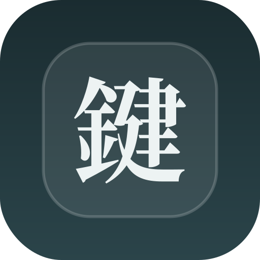
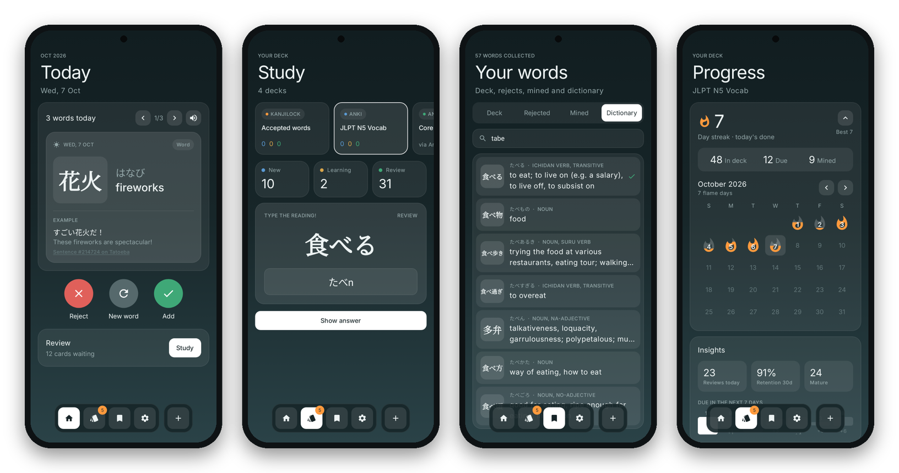
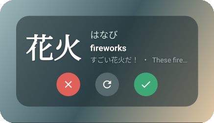

<div align="center">



# KanjiLock

one japanese word a day, right on your lock screen


<br>



</div>

<br>

## what it is

you get a kanji or word every day with the reading in kana, the meaning and an example sentence. keep it, toss it or reroll it. the ones you keep turn into a deck you study with spaced repetition

made it cuz i kept forgeting to study and i look at my lock screen like 200 times a day anyway

<br>

<table>
<tr>
<td width="55%" valign="middle">

<b>daily word</b> · home and lock screen widget<br><br>
<b>study</b> · anki style reviews, type in romaji<br><br>
<b>decks</b> · anki, kotoba and ankidroid<br><br>
<b>progress</b> · streaks, flame calendar, stats<br>
<b>dictionary</b> · 218k words, fully offline

</td>
<td width="45%" valign="middle" align="center">



<sub>X rejects, gray rerolls, check keeps</sub>

</td>
</tr>
</table>

no accounts, no ads, no tracking. sync is optional and goes to your own google drive

<br>

## get it

grab the apk from [releases](../../releases/latest), or build it yourself:

```
git clone https://github.com/Jideeh1/KanjiLock.git
```

open the folder in android studio, let it sync, hit run. needs android 8.0 or newer

<br>

## more

<details>
<summary><b>lock screen setup</b></summary>
<br>

- **samsung**: install Good Lock from the galaxy store, open LockStar and add the KanjiLock widget
- **pixel and others on android 16 qpr2+**: lock screen widgets are built in, add it from there
- everyone else gets the lock screen notification

</details>

<details>
<summary><b>google drive sync</b></summary>
<br>

google wants every app that touches drive to be registered first. you only do this once

1. make a project at [console.cloud.google.com](https://console.cloud.google.com) and turn on the Google Drive API
2. set up the OAuth consent screen (External) with the `drive.file` scope
3. create an Android OAuth client with package `com.jideeh.kanjilock` and the SHA-1 of your signing key
4. in the app go to Settings, Google Drive, Link

the app can only see the one file it makes, `KanjiLock/kanjilock-data.json`. it pulls when you open the app and pushes when you leave. two phones that both changed stuff get merged so nothing is lost

</details>

<details>
<summary><b>accepted list format</b></summary>
<br>

saved as csv so it imports straight into kotoba and other quiz apps

```
Questions,Answers,Comment,Instructions,Render as
花火,はなび,fireworks,Type the reading!,Image
```

theres also an anki export (tab seperated) that goes into a deck called KanjiLock

</details>

<details>
<summary><b>project layout</b></summary>
<br>

kept on purpose to a few files so new features go into whats already there

```
app/src/main/java/com/jideeh/kanjilock/
  Data.kt      words, storage, srs, romaji, dictionary, imports, backup
  Engine.kt    daily word, study queue, alarms, widget, notification, ankidroid, drive
  Ui.kt        activity, theme, shared components, icons
  Screens.kt   today, study, words, settings
tools/build_dict.py   builds the dictionary database
```

`./gradlew testDebugUnitTest` runs the tests

</details>

<details>
<summary><b>updating the dictionary</b></summary>
<br>

do this before each release, the edrdg licence wants the data kept up to date

1. get the latest `jmdict-examples-eng` and `kanjidic2-en` json from [jmdict-simplified](https://github.com/scriptin/jmdict-simplified/releases)
2. run `python3 tools/build_dict.py` in the folder with the json files
3. `gzip -9 dict.db` and replace `app/src/main/assets/dict.db.gz`
4. bump `VERSION` in the Dictionary object in `Data.kt`

</details>

<br>

## credits

| | source | license |
|---|---|---|
| words | [JMdict](https://www.edrdg.org/wiki/index.php/JMdict-EDICT_Dictionary_Project) by the EDRDG | [CC BY-SA 4.0](https://creativecommons.org/licenses/by-sa/4.0/) |
| kanji | [KANJIDIC2](https://www.edrdg.org/wiki/index.php/KANJIDIC_Project) by the EDRDG | [CC BY-SA 4.0](https://creativecommons.org/licenses/by-sa/4.0/) |
| sentences | [Tatoeba](https://tatoeba.org) | [CC BY 2.0 FR](https://creativecommons.org/licenses/by/2.0/fr/) |
| json data | [jmdict-simplified](https://github.com/scriptin/jmdict-simplified) | CC BY-SA 4.0 |
| font | [Inter](https://github.com/rsms/inter) | [OFL 1.1](https://openfontlicense.org) |

the dictionary was condensed into a small sqlite db for the app, it stays under CC BY-SA. everything else is in [THIRD_PARTY_NOTICES.md](THIRD_PARTY_NOTICES.md)

<br>

<div align="center">

[MIT license](LICENSE) · [privacy policy](PRIVACY_POLICY.md) · [third party notices](THIRD_PARTY_NOTICES.md)

<sub>not affiliated with Anki, AnkiDroid, Kotoba, Google or Samsung</sub>

</div>
